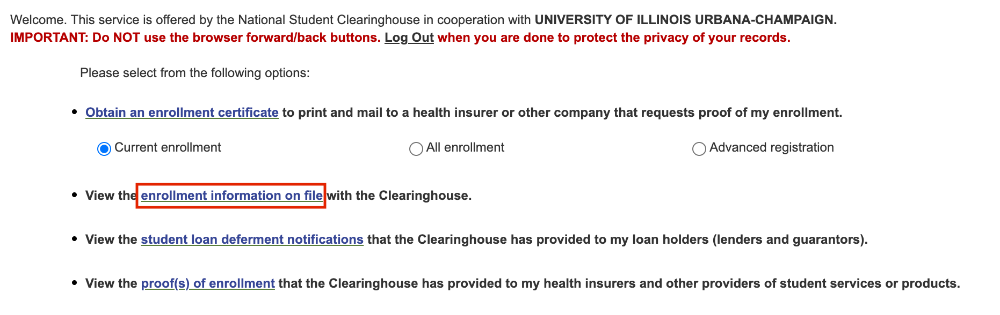

# GitHub Copilot Apply

Author: Bo Yuan (boy6@illinois.edu)

Course: STAT 530, Spring 2025

---

## 1. Register for GitHub

If you do not already have a GitHub account, you can register for one at [GitHub](https://github.com/).

## 2. Verify Your Education Status

Follow the steps below to verify your student status and gain access to GitHub Education benefits:

### Step 1: Add Your University Email

1. Navigate to [GitHub Emails](https://github.com/settings/emails).
2. Add your university email address and verify it.

### Step 2: Enable Two-Factor Authentication (2FA)

1. Go to [GitHub security settings](https://github.com/settings/security).
2. Enable **Two-factor authentication (2FA)** for your account. This step is mandatory for accessing student benefits.

### Step 3: Apply for GitHub Education Benefits

1. Visit the [GitHub Education Application Page](https://education.github.com/discount_requests/application).
2. **Important**: Ensure that any other VPNs are turned off. You may need to connect to your campus VPN to complete this step.

### Step 4: Obtain Your University Enrollment Verification

1. For UIUC students, you can download your enrollment verification document from this link: [UIUC Enrollment Verification](https://webprod.admin.uillinois.edu/ssa/jsp/NscDisclaimer.jsp?redirect=https://webprod.admin.uillinois.edu/ssa/servlet/SelfServiceLogin?appName=edu.uillinois.aits.NSCHelper&campus=1).
2. Upload the enrollment verification document:
   - Ensure the document is clear and then, add your student ID to it. (take a picture of your Student ID and combine it with the enrollment verification).
   - Check the file size and pixel resolution to meet GitHub’s upload requirements.

Here is the file you will look for:

### Step 5: Wait for Approval

Once you have submitted your application, GitHub will review it. You will know immediately if your application fails via email. If it shows "Approved," that means you succeeded!

Once approved, you can access all student benefits usually within 2-3 business days. You will be notified through email.

## 3. Activate GitHub Copilot for Free

After your student benefits are activated , you can activate GitHub Copilot Pro for free:

1. Follow the instructions in the [GitHub Copilot documentation](https://docs.github.com/en/copilot/managing-copilot/managing-copilot-as-an-individual-subscriber/managing-your-github-copilot-pro-subscription/getting-free-access-to-copilot-pro-as-a-student-teacher-or-maintainer#accessing-copilot-pro-for-free). They will also provide all of the details in the email.

## Additional Notes:

- If you encounter issues during the application process, double-check your VPN settings and university email verification. (If your application fails, GitHub will provide specific reasons in the email.)
- Feel free to contact TA (boy6@illinois.edu) if you need further assistance.
